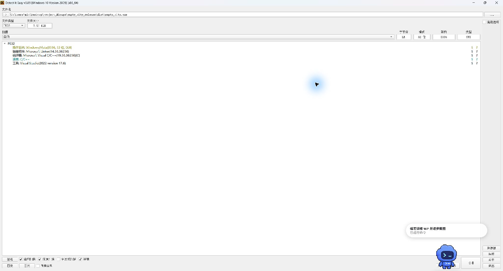
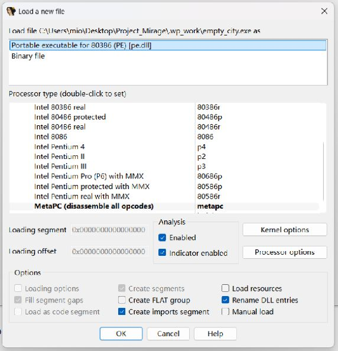
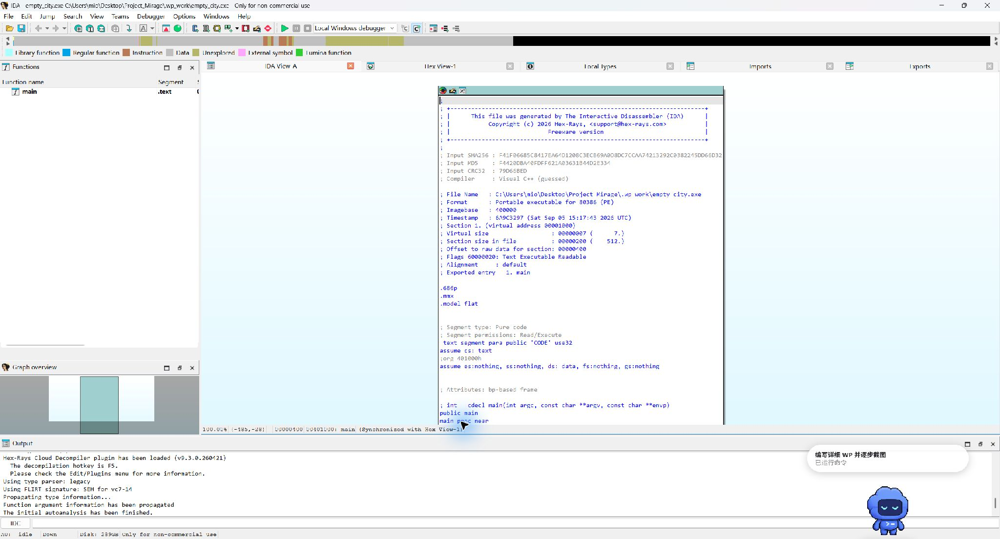
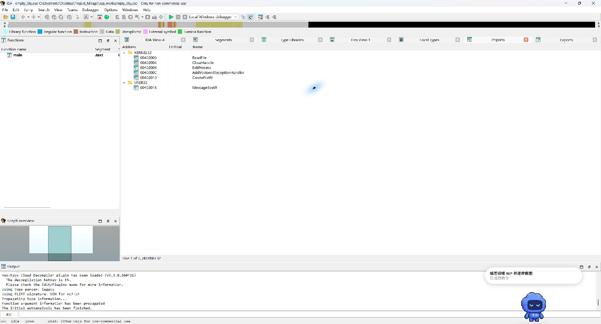
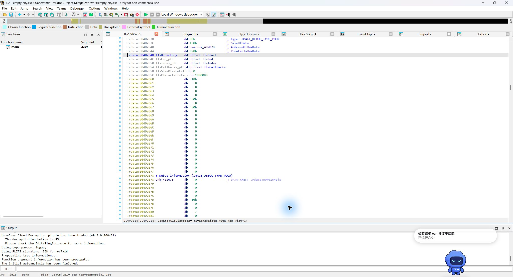
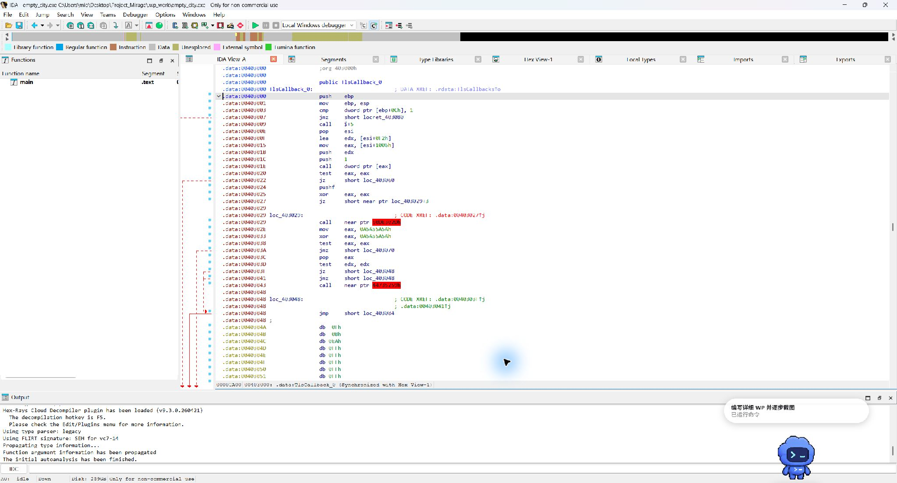
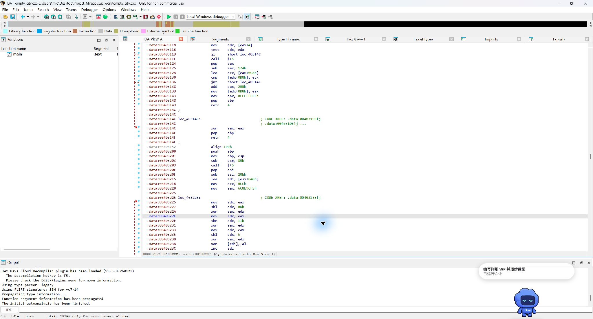
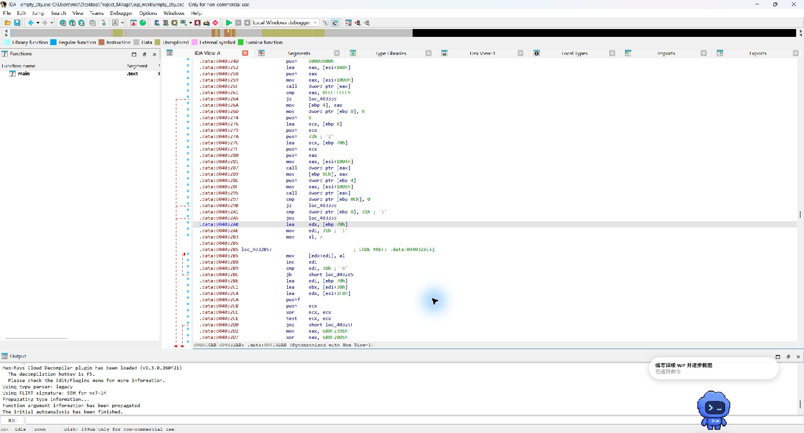
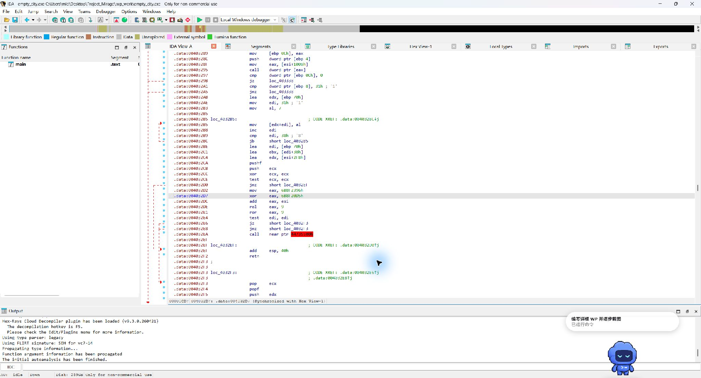
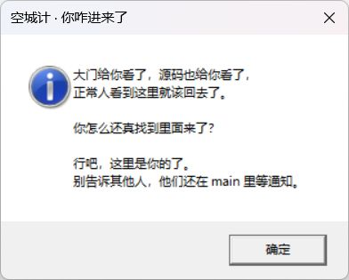

# 空城计 WP

## 题目信息

- 题目：空城计
- 类别：Reverse
- 样本：`dist/empty_city.exe`
- 平台：Windows x86 PE
- 最终 Flag：`PKWCTF{the_city_is_empty_but_TLS_is_not_9e3779b9}`

题目附件里的 `source.c` 只有一个返回 0 的 `main`，它是烟雾弹。真正的执行路径从 TLS 回调开始，利用 VEH（Vectored Exception Handler）把控制流转到 `.data` 中的机器码，再读取当前工作目录里的 `flag` 文件并校验内容。

本文使用工作目录中的 IDA Free 与 Detect It Easy 分析样本。截图按分析过程排列；完整截图保存在 [`assets/screenshots`](assets/screenshots/) 目录。

## 1. 先确认样本格式

用 Detect It Easy 打开附件，可以看到它是一个 32 位 x86 PE，体积只有 7.5 KiB。接下来在 IDA 中按 80386 PE 加载。





## 2. `main` 是诱饵

IDA 的函数列表里只有 `main`。打开反汇编后，它只有 7 字节：建立并还原栈帧、令 `EAX=0`，然后返回。这里没有题目校验逻辑。







导入表里有 `AddVectoredExceptionHandler`、`CreateFileW`、`ReadFile`、`MessageBoxW` 和 `ExitProcess`。这些 API 暗示真正的逻辑会注册异常处理函数、读文件并在成功后弹窗。

## 3. 从 PE 的 TLS 目录找到真实入口

TLS 回调在 PE 入口点之前执行，因此不能只沿着 `main` 的调用关系找代码。32 位 PE 的 TLS 目录位于 Optional Header 的 Data Directory 第 10 项（索引 9）。TLS 目录中的 `AddressOfCallBacks` 指向回调数组，数组首项就是回调函数地址。

本样本的关键地址如下：

| 项目 | RVA / VA | 文件偏移 |
|---|---:|---:|
| TLS 目录 | RVA `0x2048` | `0x648` |
| TLS 回调数组 | VA `0x402024` | `0x624` |
| 首个 TLS 回调 | VA `0x403000` | `.data` 起始处 |
| `.data` 中主体 | VA `0x403200` | `0xC00` |

在 IDA 的 TLS 数据视图中可以看到回调数组；数组首项指向 `.data` 开头，而不是 `.text` 里的 `main`。

**本步知识点：PE TLS 回调。** 这里的 TLS 是 PE 的 Thread Local Storage（线程局部存储），不是网络加密协议里的 TLS。PE TLS 目录除了线程局部数据模板，还可以保存一个以空指针结尾的回调数组。Windows 加载映像时会先调用 TLS 回调，再进入 Optional Header 中的 AddressOfEntryPoint，因此它能在 `main` 之前运行初始化逻辑。

解析时要区分三种地址：Data Directory 给出 TLS 目录的 RVA；PE32 TLS 结构里的 `AddressOfCallBacks` 是 VA；回调数组里的函数地址也是 VA。`VA = ImageBase + RVA`，RVA 到文件偏移还要经过节表换算。本样本 ImageBase 为 `0x400000`，回调 VA `0x403000` 对应 RVA `0x3000`，落在 `.data` 起始位置。混用 VA、RVA 和文件偏移是手写 PE 解析器时最常见的错误之一。




## 4. TLS 回调通过异常跳入 `.data`

回调先调用 `AddVectoredExceptionHandler(1, handler)` 注册 VEH，然后执行一条必然除零的 `idiv ecx`（此时 `ECX=0`）。这不是意外崩溃，而是主动触发的控制流转移点。



VEH 检查异常码 `0xC0000094`（整数除零），并确认异常发生在本程序预设的 `idiv` 地址。满足条件后，它把 `CONTEXT.Eip`（32 位 `CONTEXT` 中偏移 `0xB8`）改成 `.data` 主体地址，也就是 blob 起点加 `0x200`，再返回 `EXCEPTION_CONTINUE_EXECUTION`（`-1`）。不匹配的异常会返回 0，交给后续处理。


因此实际控制流可以概括为：

```text
TLS callback
  ├─ 注册 VEH
  ├─ 故意触发整数除零
  └─ VEH 将 EIP 改到 .data + 0x200
       └─ payload
```

`.data` 的节属性是 RW，没有 X 标记；这个构造依赖当前 Windows 的 DEP 策略允许执行该路径。样本以 `/NXCOMPAT:NO` 链接且未调用 `VirtualProtect`。本次截图所用主机可以正常运行；若在另一台机器上正确输入却没有弹窗，DEP 强制策略可能是环境差异。

**本步知识点：异常处理器怎样变成跳转。** 普通控制流图里，A 到 B 通常表现为 `call`、`jmp` 或条件分支。本题先让 CPU 产生一个可预测的异常，再由 Windows 根据保存的寄存器上下文恢复执行；VEH 把保存的 `Eip` 改成 payload 地址后，异常返回就承担了“间接跳到 B”的作用。这种异常驱动控制流不是为了修复错误，而是用故障事件隐藏一条分支。

VEH（Vectored Exception Handler）由 `AddVectoredExceptionHandler` 注册，属于进程级处理机制，不依赖当前函数栈帧里的 `__try/__except`。本样本传入第一个参数 `1`，请求把处理器放在 vectored handler 链前面。处理器收到 `EXCEPTION_POINTERS`，其中 `ExceptionRecord` 描述异常码，`ContextRecord` 保存故障现场的寄存器。

VEH 返回 `EXCEPTION_CONTINUE_EXECUTION`（`-1`）表示接受修改后的上下文并继续执行；返回 `EXCEPTION_CONTINUE_SEARCH`（`0`）表示当前处理器不接管，把异常交给后续处理器。样本只接管异常码 `0xC0000094` 且 EIP 等于本程序 `idiv` 地址的事件，避免把进程里其他代码的除零误当入口。32 位 x86 的 `CONTEXT.Eip` 位于偏移 `0xB8`；x64 的 `RIP` 和结构布局不同，不能照搬这个偏移。

动态分析时，可在 `AddVectoredExceptionHandler` 返回后下断，观察 `idiv` 触发的异常，并在 VEH 返回前读取 `ContextRecord->Eip`。若它已变为 `.data+0x200`，就找到了隐藏的转移目标。只跟随 `main` 的交叉引用会漏掉这条异常分发路径，因为静态调用图里没有普通的 `call payload`。

## 5. `.data` 里的主体先解码字符串

TLS 回调指向的 `.data` 起始处保存回调、VEH 和 payload 的机器码字节。payload 从 blob 偏移 `0x200` 开始。IDA 将这段数据解码成指令后，可以看到主体先把返回地址换算成 blob 基址，再对字符串区逐字节异或还原。

字符串使用 xorshift32 生成的低字节作为异或流，初始状态为 `0x6C8E9CF5`；每轮状态按 13、17、5 位移位并异或更新。文件名、标题和弹窗正文以 UTF-16LE 编码后再异或存储。

**本步知识点：把代码放进全局变量。** 源码把 `city` 定义成全局结构：前 `0x1000` 字节是 blob，后面紧跟 6 个导入函数地址。TLS 回调、VEH、payload、XTEA 和常量都作为字节放进 `.data`。这样会让“从 `.text` 函数开始反汇编”的默认流程找不到主体，也会让函数识别和交叉引用变得不完整；同一片数据里又混有机器码、密钥、密文和加密字符串，静态扫描更难直接得到语义。

这只是提高分析成本，不是加密保护：知道 TLS 回调地址后可以手动把 blob 定义为代码；查找 `AddVectoredExceptionHandler`、`idiv`、导入表指针和字符串解码循环，也能串起执行路径。调试器观察异常上下文可以直接看到跳转目标。`.data` 节没有执行标志，能否从中执行还取决于目标系统的 DEP/NX 策略；强制 DEP 的环境可能阻止样本运行。

汇编用 `call`/`pop` 取得当前位置，再减去已知标签偏移得到 blob 基址。这种位置无关寻址避免写死 `0x403000`，只要 blob 内部布局不变，装载基址变化后相对偏移仍然有效。看到短 `call` 紧跟 `pop` 时，应考虑它可能是在取当前位置，而不是普通函数调用。




## 6. 输入文件必须叫 `flag`，并且长度恰好为 49 字节

解码后的文件名是小写 `flag`。程序通过 `CreateFileW` 以只读方式打开它，使用 `OPEN_EXISTING`，路径相对于**进程当前工作目录**，不是相对于 EXE 文件所在目录。


随后程序调用 `ReadFile`，请求读取 `FLAG_LENGTH+1` 字节，也就是 50 字节。它要求 `ReadFile` 成功，并检查实际读取长度等于 49。多读一个字节的做法可以拒绝末尾换行、多余字符等情况；带 BOM、NUL 或其他额外字节的文件也无法通过。




所以本题输入必须是 49 字节 ASCII，文件内容末尾不能有换行。缺文件、打不开、长度错误或校验失败时，程序都会静默退出。

## 7. 还原 XTEA 密钥和密文

读取完成后，程序将 49 字节输入按 PKCS#7 补到 56 字节：最后追加 7 个 `0x07`。之后每 8 字节独立执行一次 XTEA，共 7 个分组。程序内的 XTEA 路径经过间接跳转和花指令混淆；虽然 IDA 可能把数据区当成代码展示，但仍可从常量布局、运算和比较逻辑恢复算法。



密钥位于 blob 偏移 `0x800`，密文从偏移 `0x810` 开始，共 56 字节。IDA 十六进制视图里，密钥按小端字节保存；按 32 位小端读取后是：

```text
key = [
  0xA17C9E43,
  0x6D20B8F5,
  0xC3E4719A,
  0x58BF026D,
]
```

对应的 56 字节密文为：

```text
66bee337eaab0987189e29c22143ba35
f849c1b5f54e118530627b083145724a
20308447e6d06b8675309dedf9bb5137
36d7e0785ce12fbd
```


加密例程是标准 XTEA：小端 32 位字、32 个 cycle、delta `0x9E3779B9`，每个 cycle 更新两个 32 位字。程序运行时把输入加密后与这段密文比较；离线求 Flag 时，对密文块执行逆运算即可。

程序还插入了恒真/恒假条件跳转、跳过的字节、看似 `CALL` 或 `UD2` 的内嵌数据，以及 `push`/`ret`、`push edx; jmp eax` 形式的间接转移。线性反汇编器如果从错误字节边界开始，可能把数据误当指令或给出并不存在的控制流边。分析时要跟踪实际条件、运行时跳转目标和 ESP 的压入/弹出配对，不能只凭反汇编窗口显示的助记符判断路径可达。

XTEA 是 64 位分组、128 位密钥的分组密码。这里 32 个 cycle 每轮更新两个 32 位字，所以共有 64 次 half-round 更新，整数运算按 `2^32` 回绕。49 字节输入经 PKCS#7 补 7 个 `0x07` 后变成 56 字节，再分成 7 块。各块独立加密，没有 IV 或链式反馈，结构等价于 ECB 式处理；它适合本题校验，不应直接用于实际文件加密。

解密每个 8 字节块时，令 `sum=0xC6EF3720`，重复 32 次并按相反顺序撤销两个半轮：

```text
v1 -= (((v0 << 4 ^ v0 >> 5) + v0) ^ (sum + key[(sum >> 11) & 3]))
sum -= 0x9E3779B9
v0 -= (((v1 << 4 ^ v1 >> 5) + v1) ^ (sum + key[sum & 3]))
```

所有运算均按 32 位无符号整数回绕。7 个块拼接后检查 PKCS#7 填充，去掉 7 个 `0x07`，剩下 49 字节就是 Flag。

逆向时先从 `sum=delta*32 mod 2^32` 开始，逆序撤销第二个 half-round、减去 delta，再撤销第一个 half-round。解出 56 字节后还要验证末尾 7 个填充值，避免把错误偏移或错误密钥得到的随机字节误认成 Flag。

## 8. 离线复现结果

附录 A 的 Python 脚本只读取分发的 PE：解析节表完成 RVA 到文件偏移转换，从 TLS 目录追到回调数组和 blob，再从 `blob+0x800`、`blob+0x810` 提取密钥与密文，最后解密 7 个 XTEA 分组并验证 PKCS#7 填充。脚本不依赖 `answer.json`、出题配置或作者保存的明文。

在工作目录运行：

```powershell
python .\solutions\solve_empty_city.py
```

运行结果：

```text
PKWCTF{the_city_is_empty_but_TLS_is_not_9e3779b9}
```

## 9. 用程序确认结果

为了验证输入条件，将 EXE 和 49 字节的 `flag` 放在同一个独立运行目录中。截图里可以看到目录中只有这两个运行所需文件。启动 EXE 后出现成功弹窗，说明工作目录、文件长度、填充和 7 个密文分组均通过校验。




## 附录 A：独立 Python 求解器

下面脚本只使用 Python 标准库。实现顺序与静态分析路径一致：验证 PE32/x86 → 读取节表 → 解析 TLS 目录和回调数组 → 定位 blob → 取出密钥与密文 → 逐块逆 XTEA → 检查 PKCS#7 和 Flag 格式。

默认样本路径相对于脚本位置；也可以手动传入 EXE 路径：

```powershell
python .\solutions\solve_empty_city.py
python .\solutions\solve_empty_city.py .\dist\empty_city.exe
```

```python

#!/usr/bin/env python3
r"""仅根据分发的 x86 PE 文件字节恢复《空城计》的 Flag。

在 Project_Mirage 工作目录中运行：
    python .\solutions\solve_empty_city.py
    python .\solutions\solve_empty_city.py .\dist\empty_city.exe

脚本不会读取 build/author/answer.json 或作者保存的明文 Flag。
它沿 PE TLS 回调指针找到内嵌 blob，从中读取 XTEA 密钥和密文，
再逆运算程序使用的 7 个 XTEA 分组。
"""

from __future__ import annotations

import argparse
import struct
from pathlib import Path


DELTA = 0x9E3779B9
INITIAL_DECRYPT_SUM = 0xC6EF3720  # 32 * DELTA 对 2**32 取模后的初始解密 sum。
MASK32 = 0xFFFFFFFF
KEY_BLOB_OFFSET = 0x800
CIPHERTEXT_BLOB_OFFSET = 0x810
CIPHERTEXT_LENGTH = 56  # 共 7 个互相独立的 8 字节分组。


def u16(data: bytes, offset: int) -> int:
    """读取一个小端 WORD；越界时给出明确错误。"""
    if offset < 0 or offset + 2 > len(data):
        raise ValueError(f"WORD 读取越过文件边界：文件偏移 0x{offset:x}")
    return struct.unpack_from("<H", data, offset)[0]


def u32(data: bytes, offset: int) -> int:
    """读取一个小端 DWORD；越界时给出明确错误。"""
    if offset < 0 or offset + 4 > len(data):
        raise ValueError(f"DWORD 读取越过文件边界：文件偏移 0x{offset:x}")
    return struct.unpack_from("<I", data, offset)[0]


def parse_sections(data: bytes, pe_offset: int, optional_offset: int) -> tuple[int, list[dict[str, int]]]:
    """返回 ImageBase 和 PE 节表，用于把 RVA 映射到文件偏移。"""
    section_count = u16(data, pe_offset + 6)
    optional_size = u16(data, pe_offset + 20)
    section_table = optional_offset + optional_size
    sections: list[dict[str, int]] = []

    for index in range(section_count):
        off = section_table + index * 40
        if off + 40 > len(data):
            raise ValueError("节表超出文件末尾")
        virtual_size = u32(data, off + 8)
        virtual_address = u32(data, off + 12)
        raw_size = u32(data, off + 16)
        raw_pointer = u32(data, off + 20)
        sections.append({
            "rva": virtual_address,
            "span": max(virtual_size, raw_size),
            "raw_size": raw_size,
            "raw": raw_pointer,
        })

    image_base = u32(data, optional_offset + 28)
    return image_base, sections


def rva_to_offset(rva: int, sections: list[dict[str, int]]) -> int:
    """根据 PE 节表把 RVA 转成文件偏移。"""
    for section in sections:
        start = section["rva"]
        delta = rva - start
        if 0 <= delta < section["span"]:
            if delta >= section["raw_size"]:
                raise ValueError(f"RVA 0x{rva:x} 位于只在内存中补零的数据区")
            return section["raw"] + delta
    raise ValueError(f"RVA 0x{rva:x} 不属于任何节")


def find_blob(data: bytes) -> tuple[int, int]:
    """沿 PE32 的 TLS 目录、回调数组和首个回调找到 blob 的文件偏移。"""
    if data[:2] != b"MZ":
        raise ValueError("缺少 DOS MZ 标记")

    pe_offset = u32(data, 0x3C)
    if data[pe_offset:pe_offset + 4] != b"PE\0\0":
        raise ValueError("缺少 PE 标记")
    if u16(data, pe_offset + 4) != 0x14C:
        raise ValueError("求解器要求 x86（IMAGE_FILE_MACHINE_I386）PE")

    optional_offset = pe_offset + 24
    if u16(data, optional_offset) != 0x10B:
        raise ValueError("求解器要求 PE32，不支持 PE32+")

    image_base, sections = parse_sections(data, pe_offset, optional_offset)

    # IMAGE_DIRECTORY_ENTRY_TLS 是数据目录索引 9。
    # PE32 的 Data Directory 数组从 Optional Header 起始偏移 96 字节处开始。
    tls_rva = u32(data, optional_offset + 96 + 9 * 8)
    if tls_rva == 0:
        raise ValueError("PE 中没有 TLS 目录")
    tls_offset = rva_to_offset(tls_rva, sections)

    # IMAGE_TLS_DIRECTORY32.AddressOfCallBacks 是结构中的第四个 DWORD（偏移 +0x0C）。
    callbacks_va = u32(data, tls_offset + 12)
    callbacks_rva = callbacks_va - image_base
    callbacks_offset = rva_to_offset(callbacks_rva, sections)

    # 以空指针结尾的回调数组第一项指向 blob 基址。
    blob_va = u32(data, callbacks_offset)
    blob_rva = blob_va - image_base
    blob_offset = rva_to_offset(blob_rva, sections)
    return image_base, blob_offset


def decrypt_xtea_block(block: bytes, key: list[int]) -> bytes:
    """解密一个 8 字节 XTEA 分组（32 个 cycle，小端 32 位字）。"""
    if len(block) != 8:
        raise ValueError("XTEA 分组长度必须恰好为 8 字节")

    v0, v1 = struct.unpack("<2I", block)
    total = INITIAL_DECRYPT_SUM

    for _ in range(32):
        # 先撤销 XTEA 的第二个 half-round。所有加减都按 uint32 回绕，
        # 与 x86 机器码里的 32 位寄存器运算一致。
        mix1 = ((((v0 << 4) & MASK32) ^ (v0 >> 5)) + v0) & MASK32
        key_index1 = (total >> 11) & 3
        v1 = (v1 - (mix1 ^ ((total + key[key_index1]) & MASK32))) & MASK32

        total = (total - DELTA) & MASK32

        # sum 已减去 delta，现在撤销第一个 half-round。
        mix0 = ((((v1 << 4) & MASK32) ^ (v1 >> 5)) + v1) & MASK32
        key_index0 = total & 3
        v0 = (v0 - (mix0 ^ ((total + key[key_index0]) & MASK32))) & MASK32

    return struct.pack("<2I", v0, v1)


def solve(exe_path: Path) -> str:
    data = exe_path.read_bytes()
    _image_base, blob_offset = find_blob(data)

    key = [
        u32(data, blob_offset + KEY_BLOB_OFFSET + index * 4)
        for index in range(4)
    ]
    cipher_start = blob_offset + CIPHERTEXT_BLOB_OFFSET
    ciphertext = data[cipher_start:cipher_start + CIPHERTEXT_LENGTH]
    if len(ciphertext) != CIPHERTEXT_LENGTH:
        raise ValueError("映射到的 blob 中没有完整的 56 字节密文")

    padded = b"".join(
        decrypt_xtea_block(ciphertext[offset:offset + 8], key)
        for offset in range(0, len(ciphertext), 8)
    )

    # PKCS#7 用 N 个数值为 N 的字节填充。本题 49 字节 Flag 补 7 个 0x07，
    # 解填充前的明文长度因此为 56 字节。
    padding = padded[-1]
    if not 1 <= padding <= 8 or padded[-padding:] != bytes([padding]) * padding:
        raise ValueError("PKCS#7 填充无效：密钥、偏移或算法可能不正确")
    flag_bytes = padded[:-padding]

    try:
        flag = flag_bytes.decode("ascii")
    except UnicodeDecodeError as exc:
        raise ValueError("解出的明文不是 ASCII") from exc
    if not (flag.startswith("PKWCTF{") and flag.endswith("}")):
        raise ValueError("解出的明文不符合预期的 Flag 前后缀格式")
    return flag


def main() -> None:
    default_exe = Path(__file__).resolve().parents[1] / "dist" / "empty_city.exe"
    parser = argparse.ArgumentParser(description=__doc__)
    parser.add_argument("exe", nargs="?", type=Path, default=default_exe,
                        help="题目 PE 路径（默认使用 dist/empty_city.exe）")
    args = parser.parse_args()
    print(solve(args.exe))


if __name__ == "__main__":
    main()

```
## 附录 B：完整 NASM 汇编源码（含常量）

本节把原始源码中的 constants.inc 展开在同一个代码块，便于独立阅读。blob 的 0x000 至 0x7FF 保存回调、VEH、payload 和 XTEA 例程；0x800 起是密钥、密文及加密字符串，0x1000 起在全局结构中排列导入函数指针。times 指令固定各标签偏移，删除填充会破坏 TLS 地址和常量位置。

汇编使用 call/pop 取得当前位置，再用标签差值恢复 blob 基址；相对偏移在装载基址变化时仍可用。下面的中文注释按入口、异常处理、文件读取、分组校验和混淆跳转解释主要指令。

```nasm
bits 32
org 0
; 构建数据仅包含密钥和比较密文，不包含 Flag 明文。
%define FLAG_LENGTH 49
%define PAD_LENGTH 7
%define PADDED_LENGTH 56
%define STRING_SEED 0x6C8E9CF5
%macro EMIT_CONSTANTS 0
xtea_key: dd 0xa17c9e43, 0x6d20b8f5, 0xc3e4719a, 0x58bf026d
expected_ciphertext: db 0x66, 0xbe, 0xe3, 0x37, 0xea, 0xab, 0x09, 0x87, 0x18, 0x9e, 0x29, 0xc2, 0x21, 0x43, 0xba, 0x35, 0xf8, 0x49, 0xc1, 0xb5, 0xf5, 0x4e, 0x11, 0x85, 0x30, 0x62, 0x7b, 0x08, 0x31, 0x45, 0x72, 0x4a, 0x20, 0x30, 0x84, 0x47, 0xe6, 0xd0, 0x6b, 0x86, 0x75, 0x30, 0x9d, 0xed, 0xf9, 0xbb, 0x51, 0x37, 0x36, 0xd7, 0xe0, 0x78, 0x5c, 0xe1, 0x2f, 0xbd
encoded_strings:
file_name: db 0xbb, 0x5e, 0x98, 0xb1, 0xec, 0xe1, 0xc3, 0x4f, 0x4e, 0xe2
message_title: db 0xdc, 0x55, 0x82, 0x7a, 0x48, 0x12, 0x09, 0xa0, 0xed, 0x27, 0xd4, 0x45, 0x6f, 0x84, 0xfb, 0x22, 0xf8, 0xec, 0xa6, 0xc3, 0x1f, 0xd0, 0x87, 0xc4
message_text: db 0x69, 0xb9, 0x14, 0x80, 0x94, 0xfa, 0xf2, 0x6b, 0xa6, 0xbe, 0x75, 0xe1, 0xce, 0x7f, 0x44, 0x35, 0xcb, 0xd2, 0xe8, 0x3f, 0x34, 0xef, 0x98, 0x05, 0x2e, 0x6f, 0x18, 0x7a, 0xde, 0xd3, 0x5c, 0xf2, 0x80, 0xe4, 0x42, 0x83, 0xde, 0x2c, 0x10, 0x0c, 0x26, 0x38, 0x2c, 0xeb, 0x76, 0x8c, 0x14, 0x42, 0x01, 0xad, 0xb9, 0xa4, 0xb0, 0x3a, 0x72, 0x0f, 0xb8, 0x3b, 0x82, 0xc2, 0xe0, 0xee, 0x32, 0xaa, 0xe9, 0xe1, 0xc6, 0x0c, 0x58, 0x43, 0xbf, 0x60, 0xdd, 0xa5, 0xf3, 0x29, 0x8b, 0xd6, 0xf8, 0xc8, 0x3b, 0x74, 0xd0, 0x1b, 0x61, 0xe1, 0x2c, 0xeb, 0x83, 0xf6, 0xb6, 0x06, 0x0d, 0x7c, 0x2e, 0xac, 0x5a, 0xc1, 0xe2, 0xfc, 0x66, 0xfc, 0xbc, 0x2c, 0x68, 0x23, 0xc3, 0xbe, 0x00, 0xfc, 0x74, 0x4f, 0x99, 0x66, 0xb3, 0xb4, 0x6b, 0x72, 0x52, 0x27, 0x58, 0x31, 0x52, 0xfe, 0x53, 0x21, 0x91, 0x16, 0xa6, 0x8c, 0x4f, 0x60, 0x61, 0x04, 0xc0, 0x74, 0xc1, 0x09, 0xff, 0x2f, 0x0f, 0xff, 0x50, 0xb0, 0xdb, 0x93, 0x58, 0xc5, 0x92, 0xcd, 0xbf, 0xab, 0x4c, 0x2f, 0xd7, 0x87, 0x52, 0x42, 0x7d, 0x18, 0x56, 0xf2, 0x3a, 0x6a, 0xc5, 0x28, 0x09, 0x1d, 0xd5, 0x80
encoded_strings_end:
%endmacro


%define IAT_CREATE  (0x1000 + 0*4)
%define IAT_READ    (0x1000 + 1*4)
%define IAT_CLOSE   (0x1000 + 2*4)
%define IAT_MSG     (0x1000 + 3*4)
%define IAT_EXIT    (0x1000 + 4*4)
%define IAT_VEH     (0x1000 + 5*4)
%define XTEA_TRANSFER_MASK 0x6B8F20D5

; 保留已验证的 TLS 布局、混淆块和固定偏移。
callback:
    push ebp
    mov ebp, esp
    cmp dword [ebp+12], 1
    jne short callback_return
    call callback_anchor
callback_anchor:
    pop esi
    lea edx, [esi + handler - callback_anchor]
    mov eax, [esi + IAT_VEH - callback_anchor]
    push edx
    push byte 1
    call [eax]
    test eax, eax
    jz short callback_exit

    pushfd
    xor eax, eax
    jz short junk_one_end
    db 0xE8, 0xFF, 0xFF
junk_one_end:
    popfd
    push eax
    mov eax, 0xA5A55A5A
    xor eax, 0xA5A55A5A
    test eax, eax
    jnz short bogus_stack_return
    pop eax
    test edx, edx
    jz short paired_end
    jnz short paired_end
    db 0xE8, 0x11, 0x22, 0x33, 0x44
paired_end:
    jmp short return_transfer
    db 0x0F, 0x0B, 0xEA, 0xFF, 0xFF, 0xFF, 0xFF
    db 0xFF, 0xFF, 0xC2, 0x7C, 0x00

times 0x60-($-$$) db 0
callback_exit:
    push byte 0
    mov eax, [esi + IAT_EXIT - callback_anchor]
    call [eax]
    leave
    ret 12

times 0x70-($-$$) db 0
bogus_stack_return:
    add esp, byte 0x40
    ret 12
times 0x80-($-$$) db 0
callback_return:
    leave
    ret 12

return_transfer:
    call transfer_anchor
transfer_anchor:
    pop eax
    add eax, byte (stack_junk - transfer_anchor)
    push eax
    ret
    db 0xE8, 0xFF, 0xFF, 0xFF, 0x7F, 0xEA, 0xCC, 0xCC, 0xCC
stack_junk:
    pushfd
    push ecx
    mov ecx, esp
    sub esp, byte 0x20
    xor eax, eax
    rol eax, 1
    mov esp, ecx
    pop ecx
    popfd
    jmp short divide_setup
    db 0xE8, 0xFF, 0xFF, 0xFF, 0x7F, 0x0F, 0x0B, 0xC2, 0x7C, 0x00

times 0xC0-($-$$) db 0
divide_setup:
    mov eax, 1
    xor ecx, ecx
    cdq
divide_site:
    idiv ecx
    push byte 0
    mov eax, [esi + IAT_EXIT - callback_anchor]
    call [eax]
    int3

times 0x100-($-$$) db 0
handler:
    push ebp
    mov ebp, esp
    mov eax, [ebp+8]
    test eax, eax
    jz .decline
    mov ecx, [eax]
    test ecx, ecx
    jz .decline
    cmp dword [ecx], 0xC0000094
    jne .decline
    mov edx, [eax+4]
    test edx, edx
    jz .decline
    call .anchor
.anchor:
    pop eax
    sub eax, .anchor
    lea ecx, [eax+divide_site]
    cmp [edx+0xB8], ecx          ; 只接管本程序主动触发的异常。
    jne .decline
    add eax, payload
    mov [edx+0xB8], eax
    mov eax, -1
    pop ebp
    ret 4
.decline:
    xor eax, eax
    pop ebp
    ret 4

times 0x200-($-$$) db 0
payload:
    push ebp
    mov ebp, esp
    sub esp, 0x80
    call .anchor
.anchor:
    pop esi
    sub esi, .anchor            ; ESI 保存全局 city.code 的基址。

    ; 调用 Win32 API 之前，先在内存中一次性解码字符串数据。
    lea edi, [esi+encoded_strings]
    mov ecx, encoded_strings_end-encoded_strings
    mov eax, STRING_SEED
.decode:
    mov edx, eax
    shl edx, 13
    xor eax, edx
    mov edx, eax
    shr edx, 17
    xor eax, edx
    mov edx, eax
    shl edx, 5
    xor eax, edx
    xor [edi], al
    inc edi
    dec ecx
    jnz .decode

    ; 打开当前工作目录中的小写文件名 flag。
    push byte 0                ; 模板文件句柄参数，未使用时为 NULL。
    push dword 0x80            ; 普通文件属性。
    push byte 3                ; 只打开已有文件，不创建新文件。
    push byte 0                ; 安全属性指针，NULL 表示使用默认属性。
    push byte 1                ; 允许其他进程同时以只读方式打开。
    push dword 0x80000000       ; 请求读取权限。
    lea eax, [esi+file_name]
    push eax
    mov eax, [esi+IAT_CREATE]
    call [eax]
    cmp eax, -1
    je silent_exit
    mov [ebp-4], eax
    mov dword [ebp-8], 0

    ; 多请求 1 字节，以拒绝超长文件和末尾换行。
    push byte 0
    lea ecx, [ebp-8]
    push ecx
    push byte (FLAG_LENGTH+1)
    lea ecx, [ebp-0x70]
    push ecx
    push eax
    mov eax, [esi+IAT_READ]
    call [eax]
    mov [ebp-12], eax
    push dword [ebp-4]
    mov eax, [esi+IAT_CLOSE]
    call [eax]
    cmp dword [ebp-12], 0
    je silent_exit
    cmp dword [ebp-8], FLAG_LENGTH
    jne silent_exit

    lea edx, [ebp-0x70]
    mov edi, FLAG_LENGTH
    mov al, PAD_LENGTH
.pad:
    mov [edx+edi], al
    inc edi
    cmp edi, PADDED_LENGTH
    jb .pad

    lea edi, [ebp-0x70]
    lea ebx, [edi+PADDED_LENGTH]
    ; 运行时计算合成返回 VA，不在指令里写死镜像地址。
    lea edx, [esi+.block_done]
.block:
    ; 从经过编码的 blob 相对偏移计算间接跳转目标。
    ; 真实路径包含 17 条指令，并以 PUSH/JMP 完成转移。
    pushfd
    push ecx
    xor ecx, ecx
    test ecx, ecx
    jnz short .transfer_bad_stack
    mov eax, (xtea_encrypt_block - $$) ^ XTEA_TRANSFER_MASK
    xor eax, XTEA_TRANSFER_MASK
    add eax, esi
    rol eax, 9
    ror eax, 9
    test edi, edi
    jz short .transfer_ready
    jnz short .transfer_ready
    db 0xE8, 0x11, 0x22, 0x33, 0x44
.transfer_bad_stack:
    add esp, byte 0x40
    ret
.transfer_ready:
    pop ecx
    popfd
    push edx
    jmp eax
.block_done:
    add edi, byte 8
    cmp edi, ebx
    jb .block

    ; 比较全部密文，不在程序中保存 Flag 明文。
    lea edi, [ebp-0x70]
    lea edx, [esi+expected_ciphertext]
    mov ecx, PADDED_LENGTH
    xor ebx, ebx
.compare:
    mov al, [edi]
    xor al, [edx]
    or bl, al
    inc edi
    inc edx
    dec ecx
    jnz .compare
    test ebx, ebx
    jnz silent_exit

    push byte 0x40             ; 信息图标和确定按钮。
    lea eax, [esi+message_title]
    push eax
    lea eax, [esi+message_text]
    push eax
    push byte 0
    mov eax, [esi+IAT_MSG]
    call [eax]
silent_exit:
    push byte 0
    mov eax, [esi+IAT_EXIT]
    call [eax]
    int3

; XTEA：32 个 cycle（64 个半轮），小端字，按 uint32 回绕。
; EDI 指向当前 8 字节分组；按调用约定保存并恢复相关寄存器。
; EDX 保存合成返回地址，例程内暂存并在返回前恢复。
xtea_encrypt_block:
    ; 条件分支跳入内嵌字节中；线性解码器可能把它误看成 CALL。
    pushfd
    xor eax, eax
    jz short .entry
    db 0xE8, 0xFF, 0xFF
.entry:
    popfd
    push ebp
    push ebx
    push edx

    ; 运行时不可达的错误栈路径，用于制造虚假的控制流边。
    mov eax, 0x693CA55A
    xor eax, 0x693CA55A
    test eax, eax
    jnz .bad_stack_return
    mov ecx, esp
    sub esp, byte 0x20
    mov esp, ecx

    ; 互补条件分支都会跳过同一段误导性字节。
    test edi, edi
    jz short .setup
    jnz short .setup
    db 0xE8, 0x11, 0x22, 0x33, 0x44
.setup:
    mov ebx, [edi]
    mov edx, [edi+4]
    xor ebp, ebp
.round:
    mov eax, edx
    shl eax, 4
    mov ecx, edx
    shr ecx, 5
    xor eax, ecx
    add eax, edx
    mov ecx, ebp
    and ecx, byte 3
    mov ecx, [esi+ecx*4+xtea_key]
    add ecx, ebp
    xor eax, ecx
    add ebx, eax
    add ebp, 0x9E3779B9

    ; 通过成对的 push/ret 在两个半轮间转移，这里并未执行 CALL。
    pushfd
    lea eax, [esi+.second_half]
    push eax
    ret
    db 0xE8, 0xFF, 0xFF, 0xFF, 0x7F, 0x0F, 0x0B
.second_half:
    popfd
    mov eax, ebx
    shl eax, 4
    mov ecx, ebx
    shr ecx, 5
    xor eax, ecx
    add eax, ebx
    mov ecx, ebp
    shr ecx, 11
    and ecx, byte 3
    mov ecx, [esi+ecx*4+xtea_key]
    add ecx, ebp
    xor eax, ecx
    add edx, eax
    cmp ebp, 0xC6EF3720
    jne .round
    mov [edi], ebx
    mov [edi+4], edx
    pop edx
    pop ebx
    pop ebp
    ret
.bad_stack_return:
    add esp, byte 0x40
    ret

times 0x800-($-$$) db 0
EMIT_CONSTANTS
times 0x1000-($-$$) db 0

```

## 附录 C：按执行流程重写的 C 语言伪代码

这份伪代码把异常跳转、数据段代码和混淆细节抽象成普通函数，便于对照主文理解整体语义。注释说明了与真实汇编的对应关系；它不是可直接编译的替代程序。

```c
/*
 * 空城计：按样本真实执行逻辑整理的 C 风格伪代码。
 *
 * 这是帮助理解控制流和校验流程的伪代码，不是可直接编译的还原源码：
 * 1. 故意除零由 x86 汇编指令实现；C 语言中的 1 / 0 属于未定义行为，
 *    编译器可能删除或改写它，不能用来模拟本题的精确异常现场。
 * 2. TLS 回调、VEH、payload 和 XTEA 函数的机器码实际存放在全局对象
 *    city.code 所在的 .data blob 中；普通 C 编译器不会把这些字节自动
 *    当作可执行函数，也不会替我们生成本题的链接布局。
 * 3. 花指令、call/pop 位置无关取基址、间接跳转、栈上传递的合成返回地址
 *    在这里抽象为普通函数调用，重点展示程序语义。
 */

#include <windows.h>
#include <stdint.h>
#include <stddef.h>

enum {
    BLOB_SIZE       = 0x1000, /* 代码与内嵌常量占用的 blob 长度。 */
    VEH_OFFSET      = 0x100,  /* VEH 机器码相对 blob 基址的偏移。 */
    PAYLOAD_OFFSET  = 0x200,  /* 正常业务 payload 的 blob 内偏移。 */
    XTEA_KEY_OFFSET = 0x800,  /* 四个小端 DWORD 密钥的起始位置。 */
    CIPHER_OFFSET   = 0x810,  /* 56 字节目标密文的起始位置。 */
    FLAG_LENGTH     = 49,     /* 输入文件必须精确为 49 字节。 */
    PADDED_LENGTH   = 56,     /* 49 字节补齐到 7 个 8 字节分组。 */
    XTEA_BLOCK_SIZE = 8,
    XTEA_CYCLES     = 32
};

#define XTEA_DELTA UINT32_C(0x9E3779B9)

typedef struct CITY_BLOB {
    /*
     * 该对象由链接布局放入全局 .data 段，而不是常见的 .text 代码段。
     * code[0..0xFFF] 保存回调、VEH、payload、XTEA 和混淆后的常量；
     * 后续六个指针对应 CreateFileW、ReadFile、CloseHandle、
     * MessageBoxW、ExitProcess 和 AddVectoredExceptionHandler 的导入地址。
     */
    uint8_t code[BLOB_SIZE];
    FARPROC iat[6];
} CITY_BLOB;

/* 原程序把整块全局结构放进 .data，形成数据中的机器码和常量 blob。 */
static CITY_BLOB g_city;

/* 在真正的汇编里，这个基址通过 call/pop 与标签相对偏移动态计算。 */
static uint8_t *blob_base(void) {
    return g_city.code;
}

/* 按小端序读取一个 32 位字，和 x86 内存中的 DWORD 字节顺序一致。 */
static uint32_t load_u32_le(const uint8_t *p) {
    return (uint32_t)p[0]
         | ((uint32_t)p[1] << 8)
         | ((uint32_t)p[2] << 16)
         | ((uint32_t)p[3] << 24);
}

/* 按小端序写回一个 32 位字。 */
static void store_u32_le(uint8_t *p, uint32_t value) {
    p[0] = (uint8_t)value;
    p[1] = (uint8_t)(value >> 8);
    p[2] = (uint8_t)(value >> 16);
    p[3] = (uint8_t)(value >> 24);
}

/*
 * 对一个 8 字节分组执行 XTEA 加密。
 * v0、v1 是两个小端 32 位字；uint32_t 加减自然按模 2^32 回绕，
 * 与 32 位 x86 寄存器运算一致。每个 cycle 包含两个 half-round。
 */
static void xtea_encrypt_block(uint8_t block[XTEA_BLOCK_SIZE],
                               const uint32_t key[4]) {
    uint32_t v0 = load_u32_le(block + 0);
    uint32_t v1 = load_u32_le(block + 4);
    uint32_t sum = 0;

    for (unsigned cycle = 0; cycle < XTEA_CYCLES; ++cycle) {
        /* 第一个 half-round：根据当前 sum 选择四个密钥字之一。 */
        uint32_t mix0 = (((v1 << 4) ^ (v1 >> 5)) + v1);
        v0 += mix0 ^ (sum + key[sum & 3]);

        /* 更新轮常数；第二个 half-round 使用更新后的 sum。 */
        sum += XTEA_DELTA;

        /* 第二个 half-round：索引由 sum 的第 11 位及低两位决定。 */
        uint32_t mix1 = (((v0 << 4) ^ (v0 >> 5)) + v0);
        v1 += mix1 ^ (sum + key[(sum >> 11) & 3]);
    }

    store_u32_le(block + 0, v0);
    store_u32_le(block + 4, v1);
}

/*
 * xorshift32 的一个状态更新步骤。
 * 字符串循环每处理一个字节就更新状态，并把结果低字节作为 XOR 密钥流。
 */
static uint32_t xorshift32(uint32_t state) {
    state ^= state << 13;
    state ^= state >> 17;
    state ^= state << 5;
    return state;
}

static void decode_embedded_strings(uint8_t *base) {
    uint32_t state = UINT32_C(0x6C8E9CF5);
    uint8_t *p = base + ENCODED_STRINGS_OFFSET; /* 汇编标签换算出的 blob 偏移。 */
    size_t length = ENCODED_STRINGS_END - ENCODED_STRINGS_OFFSET;

    /*
     * 文件名、弹窗标题、正文连续存放为 UTF-16LE 字节串。
     * 此循环原地解码整个区域，因此后续 CreateFileW/MessageBoxW
     * 可以直接使用各字符串标签指向的地址。
     */
    for (size_t i = 0; i < length; ++i) {
        state = xorshift32(state);
        p[i] ^= (uint8_t)state;
    }
}

/*
 * 向量化异常处理函数。VEH 能看到 EXCEPTION_RECORD 和异常现场 CONTEXT。
 * 返回 -1 表示恢复修改后的上下文继续执行；返回 0 表示当前处理器不接管，
 * 把异常交给后续处理器继续搜索。
 */
static LONG CALLBACK city_veh(PEXCEPTION_POINTERS ep) {
    if (ep == NULL || ep->ExceptionRecord == NULL || ep->ContextRecord == NULL)
        return EXCEPTION_CONTINUE_SEARCH;

    /* 仅处理整数除零异常，其他异常不应该被本题的逻辑吞掉。 */
    if (ep->ExceptionRecord->ExceptionCode != EXCEPTION_INT_DIVIDE_BY_ZERO)
        return EXCEPTION_CONTINUE_SEARCH;

    /*
     * 还要确认异常现场 Eip 正好指向本程序主动执行的 IDIV。
     * 进程中其他模块或线程也可能除零，不能把它们误认成预期入口。
     */
    if ((uintptr_t)ep->ContextRecord->Eip !=
        (uintptr_t)address_of_divide_site())
        return EXCEPTION_CONTINUE_SEARCH;

    /*
     * x86 CONTEXT 中保存的 Eip 指向接下来要恢复的位置。
     * 把它改为 blob+0x200 后返回 CONTINUE_EXECUTION，Windows 恢复现场时
     * 就会从 payload 开始运行，而不再回到触发异常的 IDIV。
     */
    ep->ContextRecord->Eip =
        (DWORD)(uintptr_t)(blob_base() + PAYLOAD_OFFSET);
    return EXCEPTION_CONTINUE_EXECUTION;
}

static void run_payload_and_exit(void) {
    uint8_t *base = blob_base();
    uint8_t input[PADDED_LENGTH];
    uint8_t *wide_file_name = base + FILE_NAME_OFFSET;
    uint32_t key[4];
    uint8_t *expected = base + CIPHER_OFFSET;
    DWORD bytes_read = 0;

    /* 先解码隐藏字符串，随后 API 才能读取文件名和显示消息。 */
    decode_embedded_strings(base);

    /*
     * 文件名是相对路径 flag，Windows 会按进程当前工作目录解析，
     * 并不是自动相对 EXE 所在目录。只读打开已有文件，不创建新文件。
     */
    HANDLE file = CreateFileW((LPCWSTR)wide_file_name,
                              GENERIC_READ,
                              FILE_SHARE_READ,
                              NULL,
                              OPEN_EXISTING,
                              FILE_ATTRIBUTE_NORMAL,
                              NULL);
    if (file == INVALID_HANDLE_VALUE)
        ExitProcess(0); /* 缺文件或打不开时静默结束进程。 */

    /*
     * 请求读取 50 字节，而预期 Flag 长度是 49 字节。
     * 多请求的 1 字节可以发现尾随换行或其他额外内容。
     */
    BOOL read_ok = ReadFile(file, input, FLAG_LENGTH + 1, &bytes_read, NULL);
    CloseHandle(file);
    if (!read_ok || bytes_read != FLAG_LENGTH)
        ExitProcess(0); /* 读取失败或长度不是 49 都静默退出。 */

    /*
     * PKCS#7 填充到 8 的倍数：49 mod 8 = 1，
     * 因而补 7 个值为 0x07 的字节，缓冲区总长为 56。
     */
    const uint8_t pad = PADDED_LENGTH - FLAG_LENGTH;
    for (size_t i = FLAG_LENGTH; i < PADDED_LENGTH; ++i)
        input[i] = pad;

    /* 从 blob+0x800 按小端顺序读取 XTEA 的四个 32 位密钥字。 */
    for (unsigned i = 0; i < 4; ++i)
        key[i] = load_u32_le(base + XTEA_KEY_OFFSET + i * 4);

    /*
     * 对输入执行 7 次独立的 XTEA 加密，每次处理 8 字节。
     * 块之间没有 IV，也没有前一块密文反馈，结构等同于 ECB 分组模式。
     */
    for (size_t offset = 0; offset < PADDED_LENGTH; offset += XTEA_BLOCK_SIZE)
        xtea_encrypt_block(input + offset, key);

    /*
     * 把所有字节差异 OR 在一起。只要有一个字节不同，difference 就非零；
     * 不在第一个不同字节处提前退出。
     */
    uint8_t difference = 0;
    for (size_t i = 0; i < PADDED_LENGTH; ++i)
        difference |= input[i] ^ expected[i];

    /* 56 字节全部相同才解码并显示成功提示。 */
    if (difference == 0) {
        LPCWSTR title = (LPCWSTR)(base + MESSAGE_TITLE_OFFSET);
        LPCWSTR text  = (LPCWSTR)(base + MESSAGE_TEXT_OFFSET);
        MessageBoxW(NULL, text, title, MB_OK | MB_ICONINFORMATION);
    }

    /* 成功和失败路径最终都退出；没有正常返回到 main 的流程。 */
    ExitProcess(0);
}

/*
 * PE TLS 回调会在 AddressOfEntryPoint（本题的 main）之前收到调用。
 * 真实 TLS 回调机器码位于 .data blob 的起始处，而不是 .text。
 */
static void NTAPI city_tls_callback(PVOID module, DWORD reason, PVOID reserved) {
    (void)module;
    (void)reserved;

    /* 本题只在进程附加时做一次初始化，忽略线程创建/退出等通知。 */
    if (reason != DLL_PROCESS_ATTACH)
        return;

    /*
     * AddVectoredExceptionHandler 的首参数为 1，要求处理器尽量靠前。
     * 如果注册失败，后面的主动异常就没有本题自己的处理器接管。
     */
    PVOID old_handler = AddVectoredExceptionHandler(1, city_veh);
    if (old_handler == NULL)
        ExitProcess(0);

    /*
     * 真实汇编依次设置 EAX=1、ECX=0、执行 CDQ 和 IDIV ECX，
     * 从而产生 STATUS_INTEGER_DIVIDE_BY_ZERO。
     * 这里使用占位函数表示该事件，因为 C 中直接写 1/0 是未定义行为。
     */
    trigger_intentional_x86_divide_exception();

    /*
     * VEH 把保存的 Eip 改到 payload 后，执行最终会在 payload 内调用
     * ExitProcess。因此通常不会从这个故障点返回，也不会正常进入 main。
     */
}

/* PE .text 中的 main 只有返回 0，是用来分散分析注意力的空入口。 */
int main(void) {
    return 0;
}

```

## 最终答案

```text
PKWCTF{the_city_is_empty_but_TLS_is_not_9e3779b9}
```
